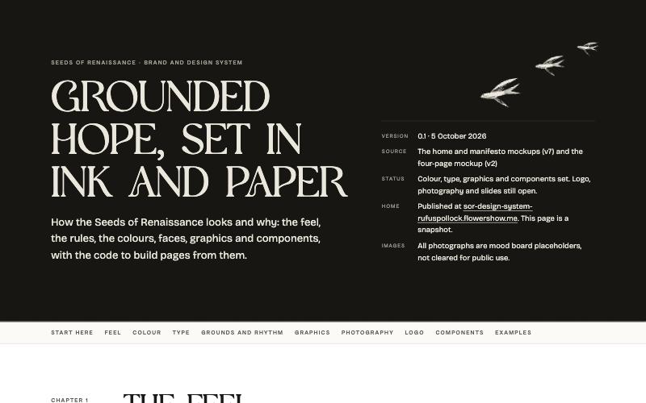

The Seeds of Renaissance brand now has a working design system, published at [sor-design-system-rufuspollock.flowershow.me](https://sor-design-system-rufuspollock.flowershow.me). Its feel is "grounded hope": ink and paper, torn edges, woodcut seeds and swallows, four typefaces, and colour that comes from photographs.

- **A visual guide** that shows it all in one scroll: colours, type, the rhythm of a page, woodcuts and every component rendered live. [See the guide](https://sor-design-system-rufuspollock.flowershow.me/guide.html).
- **Rules and code to build from**: a short [start-here brief](https://sor-design-system-rufuspollock.flowershow.me/BUILD) for people and AI agents, topic pages on feel, voice, colour, type, layout and graphics (each showing its own rendered sample), and the stylesheets and woodcut graphics themselves. AI agents can be pointed at the site's `llms.txt`.
- **Worked examples** built only from the system: six web pages (home, manifesto, gatherings, join, magazine, white paper), YouTube thumbnails including an Over the Mountains podcast cover, and a first YouTube channel set.
- **All twenty woodcuts** on one page, on any ground: [woodcuts](https://sor-design-system-rufuspollock.flowershow.me/woodcuts.html).

Photographs are still mood-board placeholders, and the voice guide, logo and slides are next.

