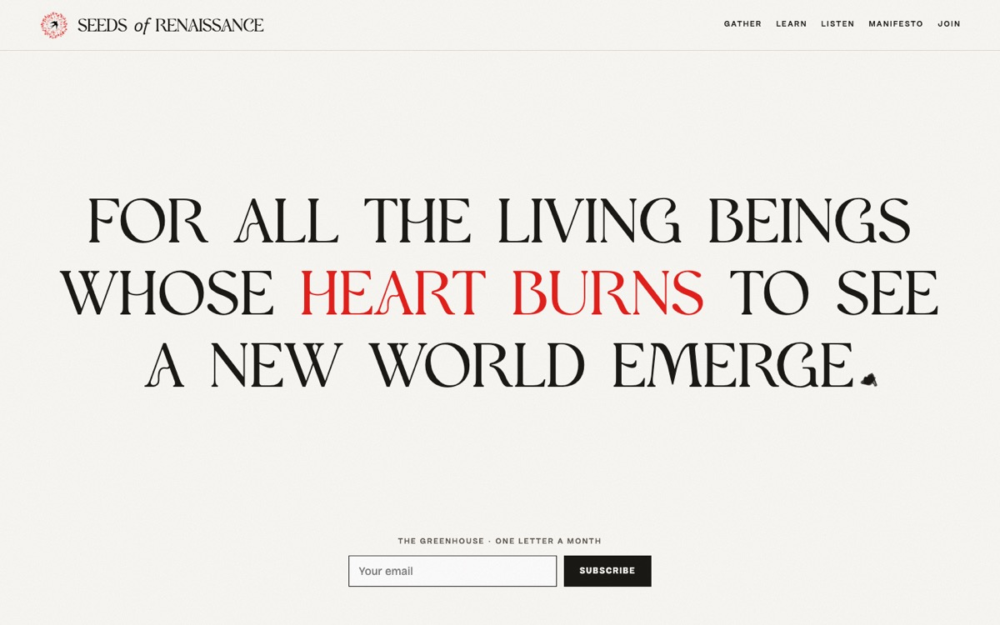
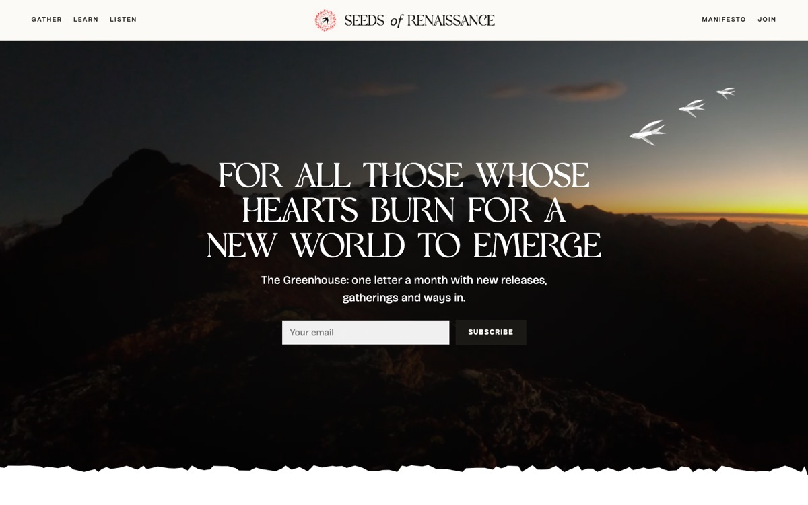
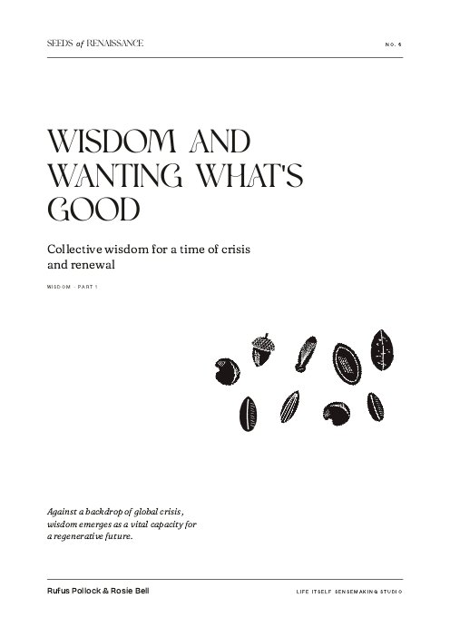
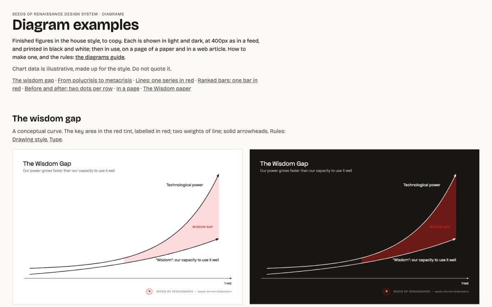
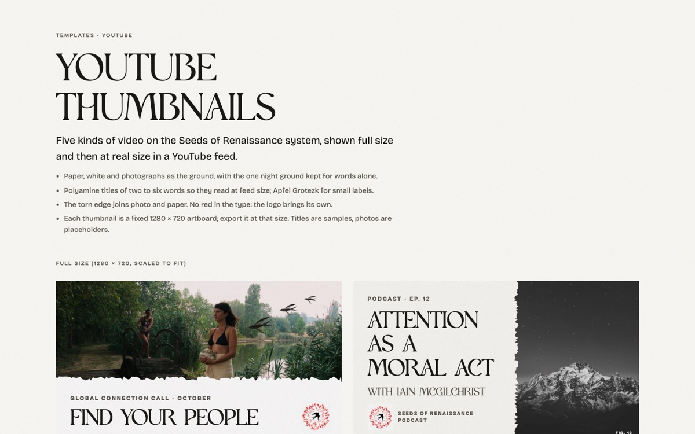

In two weeks Seeds of Renaissance went from a mood board to a working brand: a published design system, an animated Experiences scroll, a first live landing page for the real site, and house styles for papers, diagrams and YouTube. Everything below is live and can be clicked through.

**Where to look**

- [Design system](https://sor-design-system-rufuspollock.flowershow.me): the rules, tokens, woodcuts and worked examples. Start with [the visual guide](https://sor-design-system-rufuspollock.flowershow.me/guide.html).
- [SoR website](https://sor-website-rufuspollock.flowershow.me): the real site, with the new landing page.
- [Experiences](https://sor-experiences-rufuspollock.flowershow.me): the animated scroll from the seeds through dawn and the leap.
- [Website drafts](https://sor-website-drafts-rufuspollock.flowershow.me): home page mockups and hero video options.

## A brand with a feel

We started from a brief, Sylvie's mood boards and a review of reference sites, tried five visual directions, and settled on one feel: **grounded hope**. Ink and paper, torn edges, woodcut seeds and swallows, four typefaces, black buttons and red links, and colour that comes from photographs. That became [the design system v0.1](https://sor-design-system-rufuspollock.flowershow.me): one guide for people and AI agents, with topic pages on feel, voice, colour, type, layout, graphics and logo, and [all twenty woodcuts](https://sor-design-system-rufuspollock.flowershow.me/woodcuts.html) on one page.

## The Experiences scroll

The [Experiences scroll](https://sor-experiences-rufuspollock.flowershow.me) is published: a scroll that opens on the seeds arriving, dawns, and tears open into the Leap, with the manifesto and "join" as its last beats. Its colours and woodcuts now come straight from the design system.

## The landing page

The [SoR website](https://sor-website-rufuspollock.flowershow.me) is up with its first landing page, built from home page mockup B, plus the launch pages migrated from the old site. Before that we drafted two home page mockups: [B, built from the Experiences](https://sor-website-drafts-rufuspollock.flowershow.me/home/b-experiential.html) (the favoured direction) and [A, more conventional](https://sor-website-drafts-rufuspollock.flowershow.me/home/a-conventional.html) with an alpine dawn video behind the opening line. We also reviewed [24 free hero videos](https://sor-website-drafts-rufuspollock.flowershow.me/home/video-candidates.html) in five directions.

## Papers, diagrams and video

- **Papers.** How our papers look and are built, drawn page by page from *Wisdom and Wanting What's Good*: cover, contents, chapter openings, plates, pull quotes, one PDF for reading on screen. [Print guide](https://sor-design-system-rufuspollock.flowershow.me/print).
- **Diagrams and charts.** One house style for conceptual figures and charts with data, in light and dark, readable at feed size and in black and white. [Diagram examples](https://sor-design-system-rufuspollock.flowershow.me/examples/diagrams/index.html).
- **YouTube and podcast.** Thumbnails for five kinds of video and a channel set. The podcast is now one Seeds of Renaissance brand; Over the Mountains is retired as the show name. [YouTube examples](https://sor-design-system-rufuspollock.flowershow.me/examples/youtube/index.html).

## Next

Real photographs in place of mood-board placeholders, the logo, slides, social and email guides, and finishing the launch to-dos on the new site (domain, links, naming).
