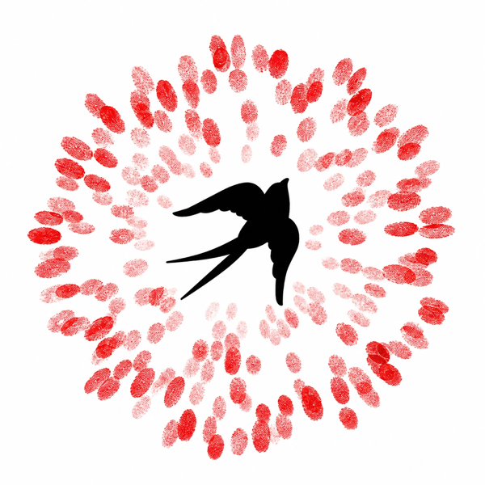
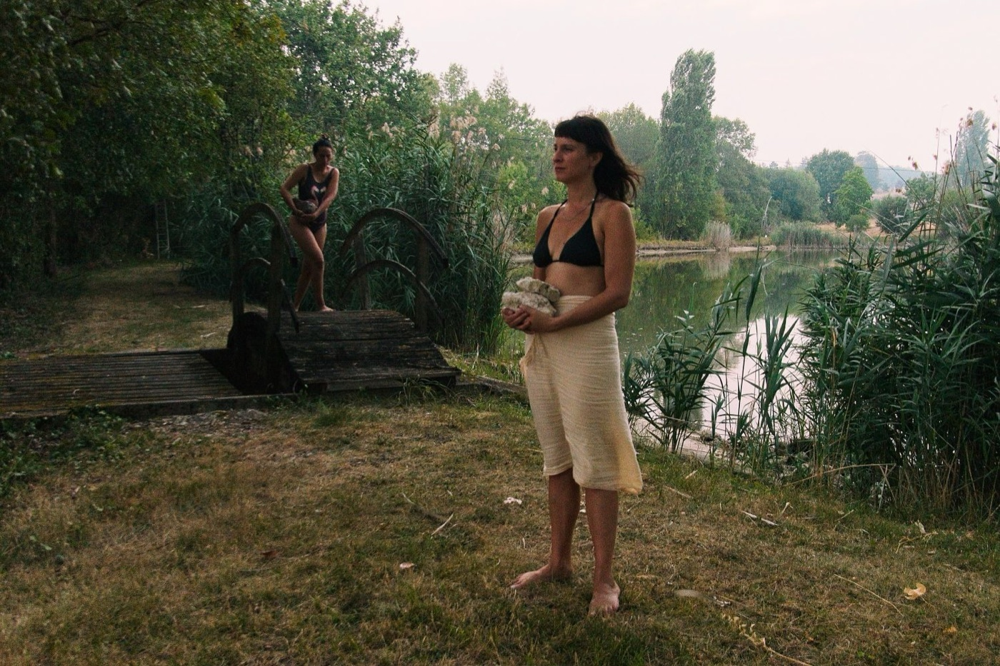
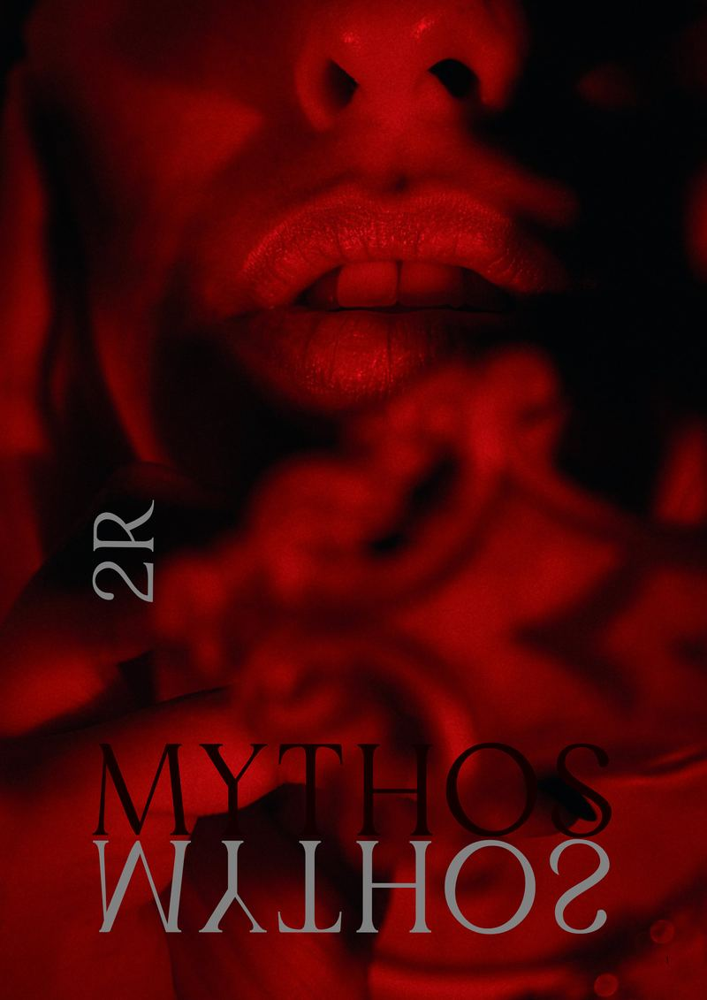

# Components

Every component in [system/components.css](system/components.css), with when to use it and the HTML to copy. See them all rendered in [guide.html](guide.html#components), and in whole pages in [examples/](examples/). Part of the [SoR design system](README.md); start from [BUILD.md](BUILD.md).

Edit the readable source `system/components.src.css`, then run `python3 system/build-css.py`.

## Base and type roles

| Class | What |
|---|---|
| `.sor` | On `<body>`. Paper ground, body type, paper grain, container for fluid sizes. |
| `.gutter` | Page side padding. |
| `.section` | Section vertical padding; a first-child `.label` becomes the section label. |
| `.ground-white` `.ground-paper` `.ground-sun` `.night` | Section grounds (see [layout.md](layout.md)). |
| `.display` | Polyamine, for inline display text. |
| `.label` | Small uppercase Apfel label. Add `.muted` for grey. |
| `.poem` / `.poem-strong` | Soft italic serif, light / medium. |
| `.link` | The red in-text link. |

## Buttons, links, fields

When: one solid button per section for the main action; outline for secondary actions; `.text-link` inside lists.

```html
<a class="btn btn--solid" href="#">Save a place</a>
<a class="btn" href="#">How to join</a>
<a class="text-link" href="#">Register</a>
<p>… <a class="link" href="#">Read the manifesto</a></p>
<input class="field" id="email" type="email" placeholder="Your email" aria-label="Email">
```

Inside `.night`, buttons turn chalk automatically.

## Site header

When: every page. Use `--centred` over a full-bleed photo hero.

```html
<header class="site-header gutter">
  <a class="wordmark" href="/"><span>Seeds <em>of</em> Renaissance</span></a>
  <nav class="label"><a href="#">Gather</a><a href="#">Listen</a><a href="#" aria-current="page">Read</a><a href="#">Magazine</a><a href="#">Join</a></nav>
</header>
```

## Photo hero

When: the one statement of a landing page, over a strong landscape photograph. Five to ten words of Polyamine.

```html
<section class="hero-photo">
  
  <svg class="flock woodcut" viewBox="0 0 300 180" aria-hidden="true">…three #wsw uses, see home.html…</svg>
  <div class="overlay">
    <span class="label">Gathering · Thursday 15 October</span>
    <h1>The Global Connection Call</h1>
    <p>An hour together, online, for those who sense the old world is ending and want to help seed the new.</p>
    <a class="btn btn--solid" href="#">Save a place</a>
  </div>
  <span class="tear tear--overlay" style="background:var(--white)"></span>
</section>
```

## Split hero

When: a landing page without a strong landscape photo. Statement beside a laid-down print.

```html
<section class="hero-split gutter ground-sun">
  <div class="text"><span class="label muted">…</span><h1>…</h1><p>…</p><a class="btn btn--solid" href="#">…</a></div>
  <figure class="print"><figcaption><span class="fig-no">Fig. 1</span>…</figcaption></figure>
</section>
```

## Page title

When: inner pages. Title, dedication in the poetic voice, a print; a seed spiral behind.

```html
<section class="page-hero gutter ground-sun">
  <svg class="spiral woodcut" viewBox="0 0 200 200" aria-hidden="true"><use href="#c-spiral"/></svg>
  <div><span class="label muted">Manifesto</span><h1>A Manifesto for Civilizational Renewal</h1><p class="dedication poem">For all the living beings…</p></div>
  <figure class="print">…</figure>
</section>
```

## Statement

When: what we believe. One light paragraph, one sentence in `.poem-strong`, one red link, a sown row, a plate.

```html
<section class="section gutter ground-white">
  <span class="label">What we believe</span>
  <div class="statement">
    <div>
      <p>Something is ending… <span class="poem-strong">We are a movement…</span> <a class="link" href="#">Read the manifesto</a></p>
      <svg class="seed-row" viewBox="0 0 290 120" aria-hidden="true"><use href="#c-row"/></svg>
    </div>
    <figure><figcaption><span class="fig-no">Fig. 1</span>…</figcaption></figure>
  </div>
</section>
```

## Pathways

When: the four ways to take part. Each keeps its seed (Gather sunflower, Practise wheat, Belong bean, Seed maple key).

```html
<div class="pathways">
  <a class="pathway" href="#"><span class="photo"></span>
    <span class="kind"><svg class="seed-icon" viewBox="0 0 100 100" aria-hidden="true"><use href="#s-sunflower"/></svg>Gather</span>
    <h3>Connection calls</h3><p>Monthly, online, open to all.</p></a>
  …
</div>
```

## Selected work (night)

When: the page's one deep section: podcast, essays, art. Hover or focus a row to change the picture (`sor.js`).

```html
<section class="night gutter">
  <span class="tear tear--top"></span>
  <svg class="seal-corner woodcut" viewBox="0 0 120 120" aria-hidden="true"><use href="#seal"/></svg>
  <span class="label">Selected work</span>
  <div class="selected">
    <ul>
      <li aria-current="true" tabindex="0" data-img="…" data-alt="…" data-cap="…"><span class="label">Podcast</span><b>Over the Mountains</b><span class="by">…</span></li>
      …
    </ul>
    <figure class="picture"><figcaption><span class="fig-no">Fig. 2</span><span class="caption">…</span></figcaption></figure>
  </div>
</section>
<span class="tear tear--bottom" style="background:var(--night)"></span>
```

## Printed object

When: the magazine or a book.

```html
<section class="section gutter ground-sun object-feature">
  
  <div><span class="label muted">In print · Issue #2</span><h2>Mythos</h2><p>…</p><a class="btn btn--solid" href="#">Subscribe · €35 a year</a></div>
</section>
```

## Calendar

When: upcoming dates, text only. One action per row.

```html
<div class="calendar">
  <div class="row"><span class="date">15 Oct</span><span><b>Global Connection Call</b><small>Online · 19:30 UK · free</small></span><a class="text-link" href="#">Save a place</a></div>
</div>
```

## Events

When: gatherings with photographs.

```html
<div class="events">
  <div class="event"><div class="body"><span class="day">15<small>Oct</small></span><div><h3>Global Connection Call</h3><p>Online, an hour, free.</p></div></div></div>
</div>
```

## Band

When: one call to action across the page, on sunlight.

```html
<section class="band gutter"><div><h2>Come to a call</h2><p>…</p></div><a class="btn btn--solid" href="#">Save a place</a></section>
```

## Interlude

When: a single poetic line between sections.

```html
<section class="section gutter ground-sun interlude">
  <svg viewBox="0 0 280 170" aria-hidden="true"><use href="#c-scatter"/></svg>
  <p class="poem">Life as an art. In this soil we plant the seeds of a Renaissance.</p>
  <span class="label muted">From the manifesto</span>
</section>
```

## Engage

When: newsletter, join, support, near the end of a page.

```html
<div class="engage">
  <div><h3>The Greenhouse</h3><p>…</p><input class="field" id="email" type="email" placeholder="Your email" aria-label="Email"><a class="btn btn--solid" href="#">Subscribe</a></div>
  <div><h3>Join the movement</h3><p>…</p><a class="btn" href="#">How to join</a></div>
  <div><h3>Support the work</h3><p>…</p><a class="btn" href="#">Become a patron</a></div>
</div>
```

## Long reading

When: articles, the manifesto. 680px measure on white.

```html
<article class="reading gutter ground-white">
  <p class="drop">First paragraph, with a Polyamine drop cap…</p>
  <div class="pull"><span>A pull quote line.</span><span>Another.</span></div>
  <p>…</p>
  <p class="verse poem">A line of verse, centred.</p>
  <ol class="litany"><li>…</li><li>The last item is set large in Polyamine.</li></ol>
  <svg class="seal woodcut" style="justify-self:center" viewBox="0 0 120 120" aria-hidden="true"><use href="#seal"/></svg>
</article>
```

## Contents

When: a magazine's table of contents, or any numbered list of works.

```html
<ol class="contents">
  <li><span class="label">Essay</span><span><b>Title</b><span class="by">Author</span></span><span class="page">12</span></li>
</ol>
```

## Footer

When: every page. Night, torn in, logo on its disc.

```html
<footer class="site-footer gutter">
  <span class="tear"></span>
  <div><span class="logo-disc"></span><b>Seeds of Renaissance</b><p>A movement for civilisational renewal, seeding what comes next.</p></div>
  <div><span class="label">Gather</span><ul><li>…</li></ul></div>
  …
</footer>
```

## From the four-page mockup

Added when porting the gatherings, join, magazine and white paper pages. Copy the markup from those examples.

| Class | When | Example |
|---|---|---|
| `.actions` | A wrapping row of buttons | gatherings, magazine |
| `.prints` | Two prints laid down overlapping, optional `.seal` in the corner: an events hero | [gatherings.html](examples/web/gatherings.html) |
| `.hero-split .flock` | A swallow flock inside a split hero | gatherings |
| `.swallows` | A small inline pair of swallows above a line | gatherings |
| `.table-wrap` + `.hubs` | "Where we gather" table; rows stack on phones | gatherings |
| `.hero-banner` | Full-bleed photo on night, label and title set low left; follow with `.tear--bottom` | [join.html](examples/web/join.html) |
| `.steps` / `.step` | Numbered ways in: seed, numeral, picture, title, text | join |
| `.voices` | Three member quotes | join |
| `.issue-hero` | Magazine cover beside a huge title, intro, actions and `.contents` | [magazine.html](examples/web/magazine.html) |
| `.poem-block` | Centred poem lines with an optional corner seal | magazine |
| `.spread` | Two plates side by side, bottoms aligned | magazine |
| `.whitepaper-head`, `.whitepaper-meta`, `.whitepaper` | Paper title, byline, and two columns with a sticky numbered contents | [white-paper.html](examples/web/white-paper.html) |
| `.abstract` | Abstract with a left ink rule | white paper |
| `.fn` / `.notes` | Red footnote marks and the notes list | white paper |
