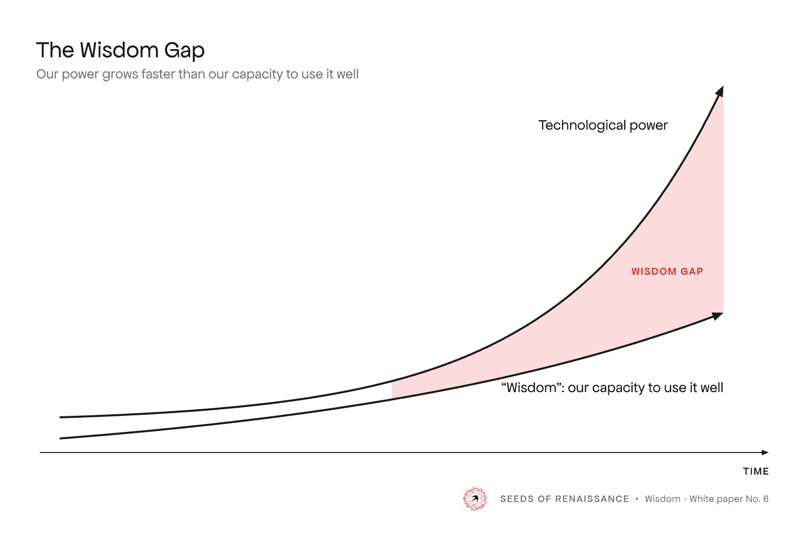
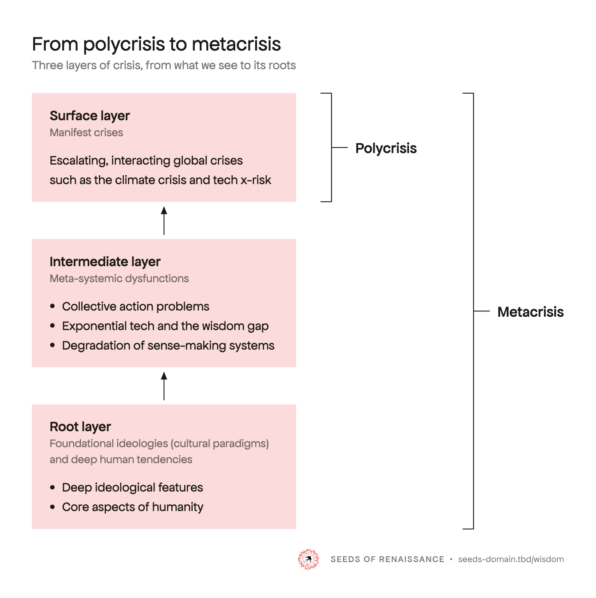
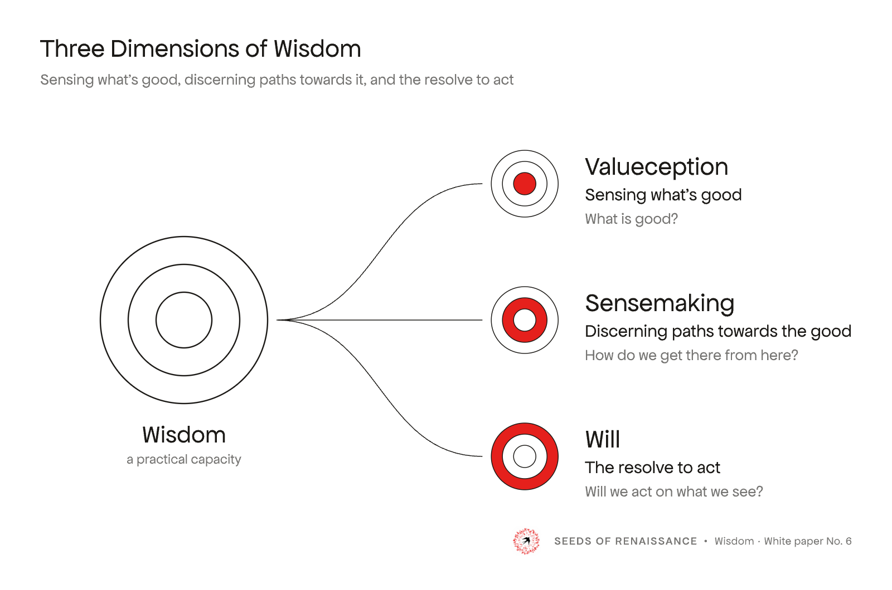
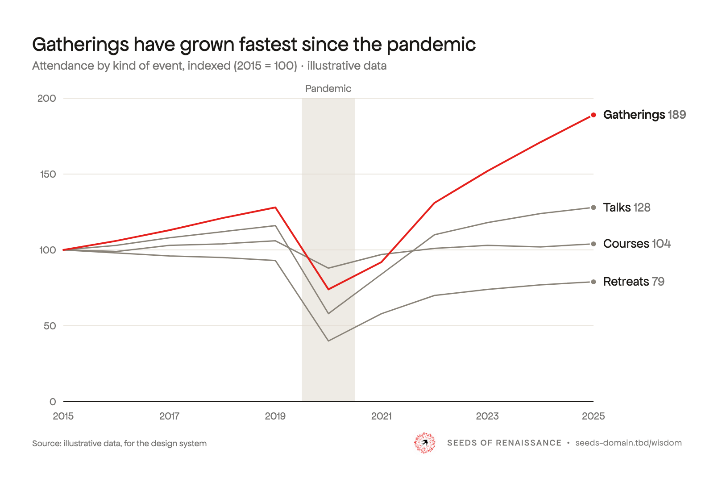

# Diagrams

Diagrams, figures, charts and frameworks: in papers, on slides, on the website, and above all shared on their own. Part of the [SoR design system](README.md); read [BUILD.md](BUILD.md) first. **v0.1, 2026-10-08.**

  
  
  
  

**All the examples, in light and dark, at feed size, in black and white and on a page: [Diagram examples](examples/diagrams/index.html).**

## The look in one paragraph

After the FT, the Economist and Tufte: restraint over decoration. One face, Apfel Grotezk, no bold. Ink lines and solid arrowheads. No outlines on boxes: groups are panels in a pale red tint, and the one thing the figure is about is in red. A title and a grey subtitle top left, the signature bottom right. Every figure must read at 400 px in a feed and printed in black and white.

## Making a figure

Figures are not drawn in a diagram tool. Sketch it (paper, whiteboard, a photo), then build it as SVG with Claude.

1. **Start from the closest example** in [`examples/diagrams/build.py`](examples/diagrams/build.py): `poly_svg` (panels and brackets), `gap_svg` (curves and a shaded area), `chart_line`, `chart_bars`, `chart_dumbbell`. Copy the function and change the content. For a figure in a paper, follow the paper's own builder (for the Wisdom paper: `2rbook/wisdom/assets/build-*.py`).
2. **Set text as outlines** with `apfel` and `apfel_m` from [`system/outline.py`](system/outline.py), so the SVG renders without the fonts installed.
3. **Sign it** with `signature(theme, url=…)` from `outline.py`: the URL, a publication line ("Wisdom · White paper No. 6") or `None`.
4. **Export** with `write_figure()` from `outline.py` (see [Exports](#exports)).
5. **Check** it against the list at the end, and look at it at 400 px and in greyscale.

For an AI agent: read this page and the example function you start from; every value below is also in that code.

## Type

Apfel Grotezk only, no Fett (bold): a diagram is working type, not billboard, and Apfel sets it apart from the Bricolage of the text around it. Sizes at a 1600 px canvas:

| Role | Face | Size | Use |
|---|---|---|---|
| Title | Apfel Regular | 46 px | Top left. Title case; ideally the claim, not the topic. Set apart by size, never weight |
| Subtitle | Apfel Regular, 60% ink | 28 px | One line under the title: what the figure shows |
| Heading | Apfel Mittel | 32 px | Panel and group headings |
| Group label | Apfel Mittel | 34 px | Bracket and group labels |
| Label | Apfel Regular | 29 px | Annotations and bullets, sentence case, on the thing they name |
| Secondary | Apfel Regular, 60% ink | 26 px | Second lines inside panels |
| Tag | Apfel Mittel, uppercase, tracked .1em | 21 px | Axis names and one-to-three-word tags only |

Nothing below about 26 px, so the smallest text is still about 7 px in a feed. No legends: label things directly. In a paper the figure keeps its title (it travels alone); the caption gives "Fig. 1" and a sentence, not the title again.

## Drawing style

- **Lines:** ink, solid, round caps. 4 px for what the figure is about, 2 px for scaffolding (axes, brackets, connectors). No dashes.
- **Arrowheads:** solid triangles; the line stops at the base of the head.
- **Panels:** groups are panels with no outline and square corners, in the red tint, as wide as their longest line plus padding. Padding 40 px on all four sides (to the top of the heading's capitals, to the text, from the last baseline).
- **Red:** full red (`#e5201c`) for the marks that matter (a line, a bar, a ring); the **red tint** for panels and the key area: the logo red at 16% on white (`#fbdbdb`), 40% on night (`#6b1a17`). Red text only for the label of that key area. This is the one red ground the system allows ([BUILD.md](BUILD.md#rules-that-apply-everywhere)).
- **Labelling an area:** centred in it, one line, nudged a touch if exact centre reads as off.
- **Black and white:** the tint prints light grey and red prints darker, so nothing relies on colour alone.
- **Canvas and ground:** draw on 1600 px wide with a 72 px margin; a narrower figure gets a narrower canvas. The content spans margin to margin, so its right edge lines up with the signature's. The drawing's ground is transparent; on dark grounds ink becomes chalk and the tint its night value.

## Charts with data

The same type, ink and red; colour is emphasis, not decoration.

- **One series in red,** the one the title is about. The rest: lines in warm grey (`#8a847a`, on night `#8f897f`), bars and areas in the red tint. Ink when two things are compared as equals.
- **The title says what to see;** the subtitle says what is measured, in what units.
- **Label directly:** names at line ends, values at bar tips, the newer value beside each dot. A key only when unavoidable. Never a number on every point.
- **Quiet scaffolding:** hairline gridlines in one direction, the zero line in ink, ticks in Apfel at 60% ink. An event is a pale band behind the data, labelled at its top.
- **Forms:** lines for change over time, ranked bars for comparison, two dots per row for before and after. One axis only, never two.
- **Source** bottom left, level with the signature ("Source: …"), as the FT and the Economist do. Publish the data beside the figure.

## The signature

Every figure is signed inside the image, so it stays attributed when it is cropped and reshared.

- **What:** the mark, then "SEEDS OF RENAISSANCE" and one optional slot, set in Apfel Grotezk at 60% ink, one line. The slot holds the URL, a publication line, or nothing.
- **Where:** bottom right, its right edge on the drawing's right edge. Same corner on every figure.
- **Size:** at 1600 px, the mark 64 px and the text 20 px (about 540 px wide). Scale the figure, never the signature.
- **Light grounds:** the mark on its white disc. **Dark:** a placeholder until the mark on dark is settled ([logo.md](logo.md#open)).
- **Too small for the mark:** drop it and keep the text. Life Itself is not shown on figures ([logo.md](logo.md#which-mark-where)).
- **Ready-made files** in `system/img/`: `signature.svg`, `signature-dark.svg`, `signature-name.svg`, `signature-name-dark.svg`, each with `.png` and `@2x.png`, transparent. Rebuild with `system/build-signature.py` (the URL is a placeholder until the domain is decided, [brand.md](brand.md#open)).

## Exports

Draw tight; the margin is added on export. `write_figure()` in `system/outline.py` writes both from one drawing:

- **For a page** (papers, the web): `name.svg`, cropped to the drawing, transparent, text outlined. The page supplies the space around it. Commit this one.
- **For sharing alone** (Substack, social, slides): `name.share.png` and `@2x`, the full canvas with its 72 px margin on white. Built on demand; not committed.
- **Alt text** says what the figure claims, not what it looks like.

## Check before you publish

- [ ] Apfel only, no bold; title, grey subtitle, labels on the things they name.
- [ ] Solid lines and arrowheads; panels without outlines, sized to their text, even padding.
- [ ] Full red only for the marks that matter, the tint for panels and the key area.
- [ ] Reads at 400 px and in black and white.
- [ ] Signed bottom right, the content's right edge lined up with the signature's.
- [ ] Exported with `write_figure()`: tight SVG for the page, padded PNG for sharing.

## Open

- The red tint may be a touch strong on large panels at full size; if so, try 12% for panels (beads, low priority).
- More chart forms as real charts need them (stacked bars, small multiples, maps).
- A small one-colour swallow for figures too small for the mark ([logo.md](logo.md#open), item 3).

How these rules were reached, with the options tried: [decisions.md](decisions.md#working-through-publication-branding-2026-10-07) and the tryouts in `archive/diagrams-*-2026-10.html`.
