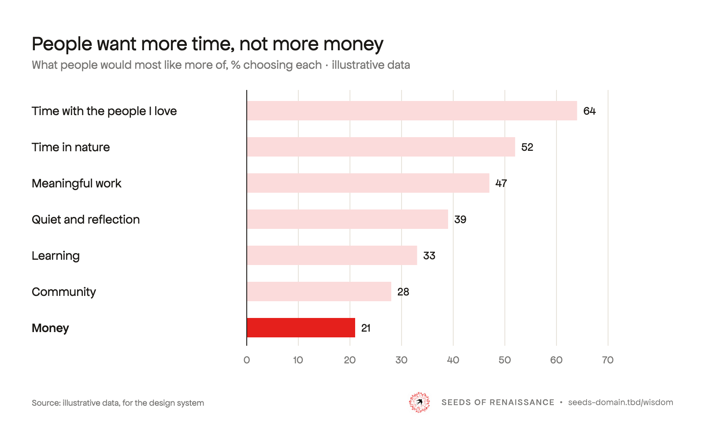
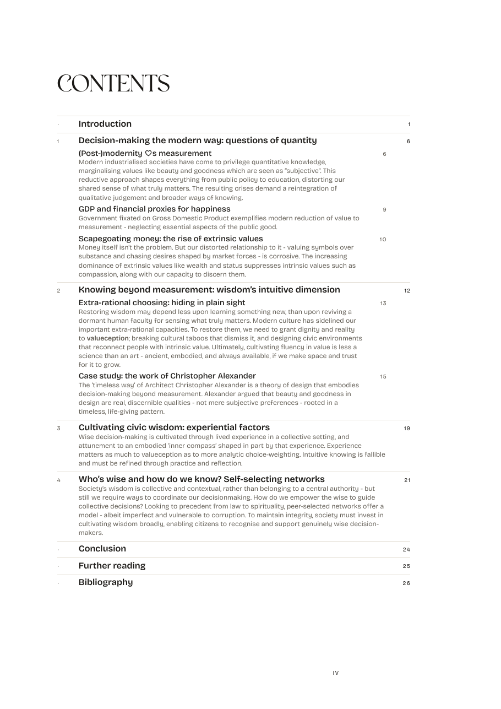

# Examples

Whole pages and assets built only from the system: the test that the system is complete, and the thing to copy. To make something new, copy the closest example and follow [BUILD.md](BUILD.md). Part of the [SoR design system](README.md).

## Status

✅ done · 🚧 in progress · ⏳ to build. Each kind has a guide (how to make it) and, once built, examples to copy. Detail in beads under `design-34t` (IDs in the last column).

| Kind | What it covers | Guide | Examples | Status | Beads |
|---|---|---|---|---|---|
| **Website** | Pages: home, manifesto, gatherings, join, magazine, white paper | [website.md](website.md) | [below](#website) | ✅ **v0.1 done.** Sylvie's notes (white default, torn edges often) still to apply | `.14` |
| **Social media** | Announcements and posters in 16:9, 4:5, 1:1, 9:16; Instagram, LinkedIn, Substack, link previews, profile banners; the Canva kit | [social.md](social.md) | — | ⏳ **To build**, brief ready | `.15` |
| **YouTube** | Video thumbnails, channel banner, avatar, lower third, watermark | [youtube.md](youtube.md) | [below](#youtube) | 🚧 **First pass done**, polish in progress | `.5` `.6` |
| **Podcast** | Show art (3000²), episode art, the video guest cover | [podcast.md](podcast.md) | guest cover in [examples/youtube/](examples/youtube/index.html) | 🚧 **Stub**; 16:9 guest cover first pass done | `.16` `.8` |
| **Slides** | Talk and workshop decks | [slides.md](slides.md) | — | 🚧 **Brief ready**, in progress | `.12` |
| **Print** | Papers as PDF, A3 posters, later magazine pages | [print.md](print.md) | [below](#print) | ✅ **v0.1 done**: the Wisdom paper; A3 poster later | `.22` `.28` |
| **Diagrams** | Figures, charts and frameworks, in papers and shared alone; the signature | [diagrams.md](diagrams.md) | [below](#diagrams) | ✅ **v0.1 done**: signature, type, drawing style, charts with data | `.20` `.25` `.26` |
| **Email** | The Greenhouse newsletter | [email.md](email.md) | — | ⏳ **To build** | `.18` |

Each kind has its own folder under `examples/`.

## Website

Pages for the Seeds of Renaissance website, one per register.

<iframe class="specimen" src="specimens/examples-web.html" style="aspect-ratio:1000/1400" loading="lazy" title="Website examples"></iframe>

| Example | Register |
|---|---|
| [Home](examples/web/home.html) | Landing page |
| [Manifesto](examples/web/manifesto.html) | Long reading |
| [Gatherings](examples/web/gatherings.html) | Events and community |
| [Join](examples/web/join.html) | Joining |
| [Magazine](examples/web/magazine.html) | Publication |
| [White paper](examples/web/white-paper.html) | Research |

## YouTube

Thumbnails, podcast covers and channel art. What we need, what exists and what's next: [youtube.md](youtube.md).

<iframe class="specimen" src="specimens/examples-youtube.html" style="aspect-ratio:1000/522" loading="lazy" title="YouTube examples"></iframe>

- [Thumbnails and podcast covers](examples/youtube/index.html), 1280×720, full size and in a feed.
- [Channel art](examples/youtube/channel.html): banner, avatar, lower third, watermark.

## Diagrams

Figures, frameworks and charts in the house style. How to make one: [diagrams.md](diagrams.md).

  
  
  

- [Diagram examples](examples/diagrams/index.html): the wisdom gap, polycrisis to metacrisis, and three charts (lines, ranked bars, before and after), each in light and dark, at 400px and in black and white; on a page of a paper and in a web article; and the Wisdom paper's published figures.
- Built by `examples/diagrams/build.py`, whose functions are the starting point for a new figure.

## Print

Papers as one A4 PDF, read on screen. How to make one: [print.md](print.md).

  
  
  
  

- [Print examples](examples/print/index.html): the Wisdom paper page by page (covers, title page, imprint, contents, a chapter opening, body pages with a figure, quotes and a summary box), and a link to the whole PDF.
- Built with Typst in `pdf-report-publishing` (`typst/build-paper.sh`), from the `--print-*` tokens.

## Open across all of them

- **Sub-brands (major).** Are *Mythos*, the papers, courses, *Gardens of Change* and *The Greenhouse* sub-brands with their own lockups and accents, or Seeds of Renaissance with a label? This shapes podcast, social, print and email. Beads `.11`.
- **Font licences.** Polyamine and Restora must be bought before anything public, PDFs and Canva included. Beads `.2`.
- **Logo.** A small version for avatars and favicons; possibly a redrawn swallow. See [logo.md](logo.md).
- **Photography.** Every photo so far is a placeholder. See [photography.md](photography.md).
