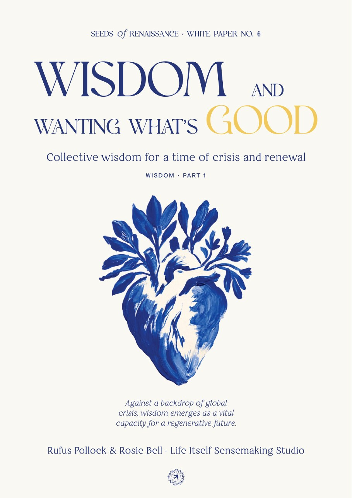
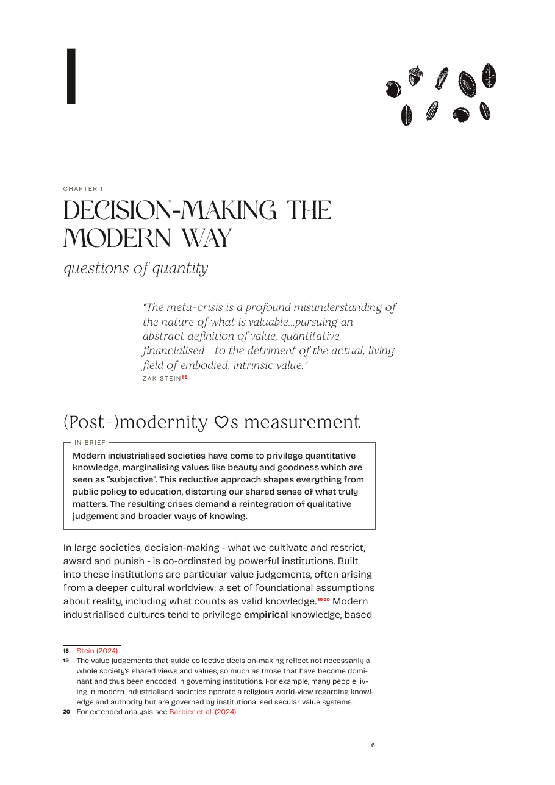
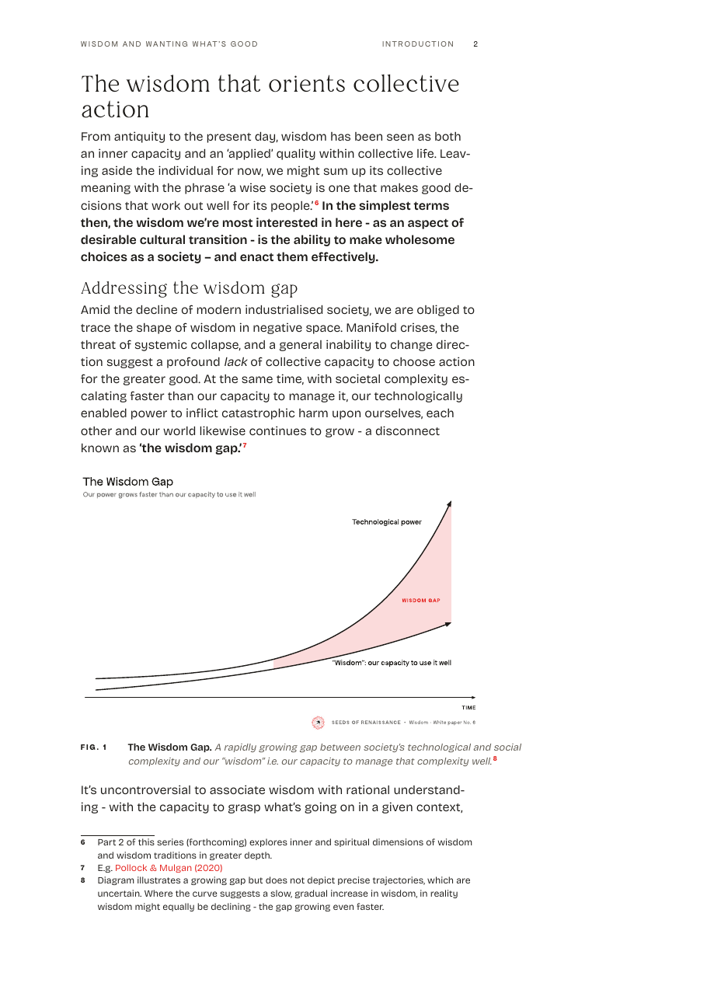
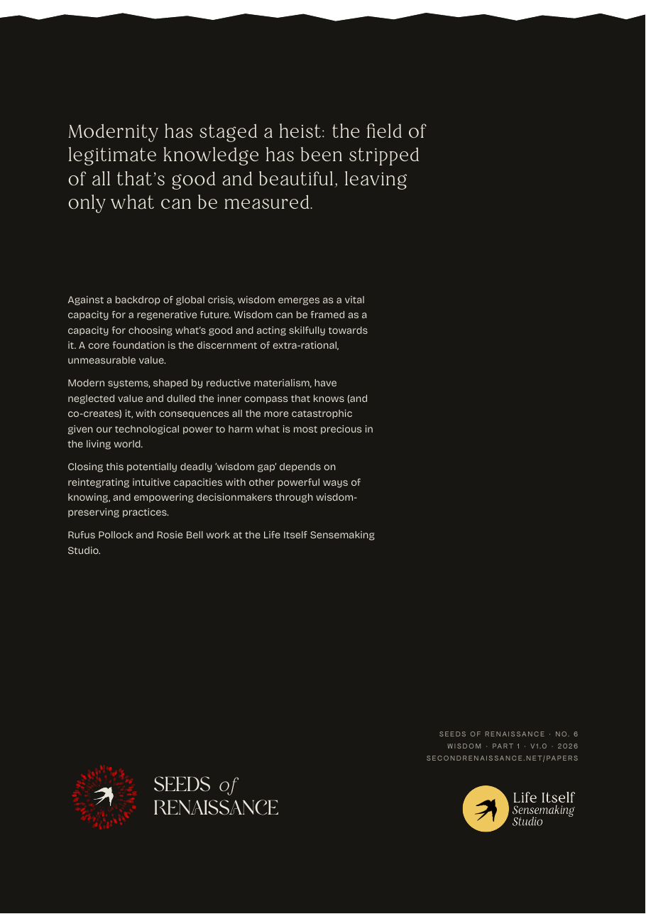

# Print

Papers as PDF, and later posters and magazine pages. Part of the [SoR design system](README.md); read [BUILD.md](BUILD.md) first. **v0.1, 2026-10-08.**

  
  
  
  

**The Wisdom paper page by page: [Print examples](examples/print/index.html).** The whole thing: [the PDF](https://secondrenaissance.net/assets/wisdom/wisdom-and-wanting-whats-good.pdf).

## The look in one paragraph

Typeset, not word-processed. One A4 PDF, read on screen, white pages. Bricolage for the text, spaced paragraphs on a 118mm measure; Restora for section heads, quotes and epigraphs; Polyamine only for the cover, title page, contents and chapter titles; Apfel for running heads, folios and labels. Chapters open with a woodcut. Figures sit bare on the page. Red only for links and note marks. The back cover is the one night.

## Making a paper

The whole process is in [How we build a paper](publishing.md). In short:

1. **Final text in Markdown**, one master per paper (for 2R papers, `2rbook/<topic>/essay.md`); title page, imprint and back-cover fields in its front matter.
2. **Editorial pass**: mark summary boxes, epigraphs and pull quotes (the `pdf-report` skill in `pdf-report-publishing`, step 5).
3. **Figures**: redraw in house style and sign them ([diagrams.md](diagrams.md)).
4. **Cover**: plain typographic by default; a paper with its own art gets a bespoke cover, built as HTML ([below](#covers-and-credits)).
5. **Render** with Typst in [`pdf-report-publishing`](https://github.com/life-itself/pdf-report-publishing): `typst/build-paper.sh <paper>`. The `sor` style takes its sizes from the `--print-*` tokens in `system/tokens.css`; change a value there, then rebuild.
6. **Check** against the [anatomy](#anatomy-of-a-paper), the [examples](examples/print/index.html) and the list at the end.

The PDF is published with the paper (for 2R papers on secondrenaissance.net), not kept here.

For an AI agent: read this page, `publishing.md` and the Typst `sor` style; every value below is in `system/tokens.css`.

## Anatomy of a paper

In order. Every part starts on a new page; no blank pages.

| Part | Holds | Optional |
|---|---|---|
| Front cover | Series line, title, subtitle, part line, credit ([below](#covers-and-credits)) | |
| Title page | Series line, title, subtitle, part line, authors, the Life Itself credit in text. No logo, no art, no blurb | |
| Imprint | Small print at the foot, the rest empty: a line about the series, edition, version and publisher, authors, acknowledgements, credits (figures, woodcuts, typefaces), copyright and licence (CC BY 4.0), how to cite, URL | |
| Summary | The paper in a few paragraphs | yes |
| Contents | Sections with page numbers, ideally a one-line summary under each | summaries |
| Preface | Where the paper sits in the series and why it was written | yes |
| Introduction | Unnumbered; arabic page numbers start here (front matter in roman) | |
| Chapters | Numbered. Opening: number, title, woodcut, epigraph, then the first section and its summary box. Body: running heads, footnotes, figures, quotes | epigraph, summary box |
| Conclusion | Unnumbered | |
| Further reading, bibliography, appendices | Each on a new page | further reading, appendices |
| Back cover | The one night: a hook line, about 120 words on what the paper argues, the inverted mark with the wordmark, the colophon (series, part, version, year, URL), the Life Itself Sensemaking Studio logo | |

## Type and page

A4, white, no fill. Margins 22mm top, 26mm bottom, 24mm and 20mm sides; text 118mm wide (about 70 characters).

| Role | Face | Size |
|---|---|---|
| Cover title | Polyamine | 46pt |
| Title page, contents, chapter titles | Polyamine | 30pt |
| Section head (`###`) | Restora, sentence case | 19pt |
| Sub-section head (`####`) | Restora medium | 14pt |
| Subtitle, standfirst | Restora | 13pt |
| Displayed quote | Restora italic | 15pt; past about 60 words, 11.5pt |
| Epigraph | Restora italic | 11.5pt |
| Body | Bricolage, light | 10.5 on 14.5pt |
| Summary box | Bricolage medium | 9.5pt |
| Caption | Bricolage | 8.5pt |
| Footnotes | Bricolage, numbers in Apfel | 8 on 11pt |
| Running head, folio, figure number, labels | Apfel, uppercase, tracked | 7pt |

## The elements

- **Running heads**: the same on every page, across the text column: the paper's title at the left, the chapter and folio at the right. None on the title page, imprint, contents and chapter openings; openings carry the folio at the foot.
- **Paragraphs** spaced by half a line, not indented.
- **Emphasis** in the body: an oblique Bricolage (the upright slanted 11°), for titles of works and a stressed word. Bricolage has no italic.
- **Figures** sit bare on the page, the width of the text column, at its left edge; cropped to their drawing; then "Fig. 1" in Apfel and a caption. They carry their own signature ([diagrams.md](diagrams.md)).
- **Quotes**: displayed in Restora italic, the source below in Apfel.
- **Summary box** ("In brief"): a 0.4pt rule in `--muted`, the label set on the rule.
- **Footnotes** numbered from 1 in each paper, linked both ways.
- **Tables**: 8.5pt between hairlines, header row semibold, no fills.
- **Woodcuts** open chapters and may sit on the cover.
- **Red** only for links and note marks. No pale yellow, no tint on pages.

## Covers and credits

Which mark goes where: [logo.md](logo.md#which-mark-where).

- **Papers are the Seeds of Renaissance series**, numbered on from the Second Renaissance series (*Wisdom and Wanting What's Good* is No. 6).
- **Front cover, top to bottom:** series line ("Seeds *of* Renaissance · White Paper No. 6", small, in the wordmark face, "of" in Fraunces italic); title; subtitle; part line if any ("Wisdom · Part 1", small); the art at full size; optional one-line blurb, smaller than the credit; authors with the Life Itself credit, one line, one size; optionally the one-colour mark, small, centred at the foot.
- **Keep it simple.** Start from art, title, series line and credit; add the rest only if needed.
- **Plain typographic cover** when a paper has no art: the same order, ink on white, a woodcut in place of the art.
- **On the front, only the one-colour mark** in the cover's ink, never the red one. The colour mark with its wordmark, and the Life Itself logo, go on the back.
- **Cover art may bring its own palette** (Wisdom's is blue and gold); the series line takes the cover's ink, not the logo red.
- **Export covers at print resolution**: A4 at 300 dpi is 2480 × 3508 px. Social images are crops from the art, not the cover ([social.md](social.md#rules-for-social)).

## The PDF

- **One PDF, A4, for reading on screen**, which also prints cleanly at home. No print edition, no Letter edition.
- **Links live**: footnotes to their notes and back, the contents to the sections, PDF bookmarks for chapters.
- **Covers in the same file**: front cover page one, back cover last.
- **For a printed run**, use the same file on a natural or cream uncoated stock, add bleed to the covers, and start chapters on a right-hand page.

## Check before you publish

- [ ] Every part of the anatomy in order, each on a new page, no blank pages.
- [ ] Polyamine only on the cover, title page, contents and chapter titles; heads inside in Restora.
- [ ] Running heads the same on every page, none on openings; front matter in roman, the text in arabic.
- [ ] Figures bare, aligned with the text, signed; captions with "Fig. N".
- [ ] Footnotes numbered from 1 and linked; links work; bookmarks for chapters.
- [ ] White pages; red only for links and note marks.
- [ ] Imprint has the version, licence and how to cite; the back cover the same version.

## Open

- An A3 event poster, when an event needs one (`design-34t.28`).
- Later: a magazine page or spread, a printed flyer.

How these rules were reached: [decisions.md](decisions.md#working-through-papers-2026-10-07-to-08) and the approved mockups in `archive/print-mockups-2026-10.html`.
